# Knights of Columbus Tracking Platform — Member User Guide

**Audience:** Brother Knights who volunteer, log service hours, attend meetings, file expenses and take donations.

**Covers:** the phone app and the member pages of the web portal.

> **Officers and Admins:** read this guide first. Officers volunteer too, so every member task applies to officers.
> The management pages are in the [Administrator User Guide](ADMIN_USER_GUIDE.md).

---

## Contents

1. [About the platform](#1-about-the-platform)
2. [Get into your account](#2-get-into-your-account)
3. [Sign up for shifts](#3-sign-up-for-shifts)
4. [Log your hours with the Rapid-Tap grid](#4-log-your-hours-with-the-rapid-tap-grid)
5. [Read agendas and follow live meetings](#5-read-agendas-and-follow-live-meetings)
6. [File expenses and check status tags](#6-file-expenses-and-check-status-tags)
7. [Take donations at an event](#7-take-donations-at-an-event)
8. [Propose a charity grant](#8-propose-a-charity-grant)
9. [Messages, roster, profile and display](#9-messages-roster-profile-and-display)
10. [Troubleshooting reference](#10-troubleshooting-reference)
11. [Automated messages reference](#11-automated-messages-reference)

### How to read a task

Each section starts with a **Before you start** box. The box lists who may use the section and what can be lost.

Each task then uses the same parts, in the same order.

| Part | What the part tells you |
| --- | --- |
| **Who can do this** | The roles that may do the task. Read this line first. |
| **Warning** | A permanent effect, such as lost data or a sent message. |
| **Goal** | The result of the task, in one sentence. |
| **Start point** | The screen where the task starts. |
| **Steps** | One action per step. |
| **Expected result** | What you see when the task succeeds. |
| **Common problems** | Symptoms, causes and fixes. |

---

## 1. About the platform

> **Before you start**
> - **Access:** every member on the council roster.
> - **Data loss:** none. This section explains the platform. It contains no tasks.

### 1.1 Two ways in, one account

The platform has two parts.

- The **phone app** is for work at an event. Use the phone app to sign up, log hours, follow agendas and take donations.
- The **web portal** opens in a web browser. Use the web portal for long forms, history tables and council records.

One email address and one password open both parts. You create the password in the phone app.

### 1.2 Who adds you

A member cannot register alone. A council Admin adds each member to the roster.
The Admin uses the email address that the council has on file for you. That email address is your sign-in name.

### 1.3 Phone tabs

The phone app has five tabs at the bottom of the screen. A gold bar marks the open tab.

| Tab | Use the tab to |
| --- | --- |
| **Home** | See your upcoming shifts and your expense report summary. |
| **Mtgs** | Answer meeting invitations and read meeting agendas. |
| **Signup** | Find shifts in the next 30 days and sign up. |
| **Report** | Log hours for a council activity or for a shift. |
| **Donate** | Record cash, card, QR-code and item donations. |

The navy header at the top of the phone has two more controls.

- The **envelope** opens **Messages**. A gold number shows your unread messages.
- **Your name** opens **Settings**. **Settings** holds the large text switch and **Sign out**.

> **Council modules:** your council can switch off some modules. A switched-off module has no tab and no menu link.
> The **Mtgs**, **Signup** and **Donate** tabs can be switched off. The **Home** and **Report** tabs always show.

### 1.4 Web portal sidebar

The web portal sidebar has seven groups, called pillars. Every member sees these member pages.

| Pillar | Member pages |
| --- | --- |
| **Governance** | Meeting Center, Council Officer Nominations, Constitutional Bylaws |
| **Faith In Action** | Member Actions Hub, Visual Master Calendar |
| **Finances** | My Expense Reports, Propose Charity Grant, Annual Budget Projections |
| **Performance** | Post-event Ledger (event owners record results here) |
| **Resources** | Fraternal Photo Gallery, Bulletins |
| **Answers** | Online Help Center, SOP Center |

<!-- KEEP_IMAGE: member actions hub placeholder -->
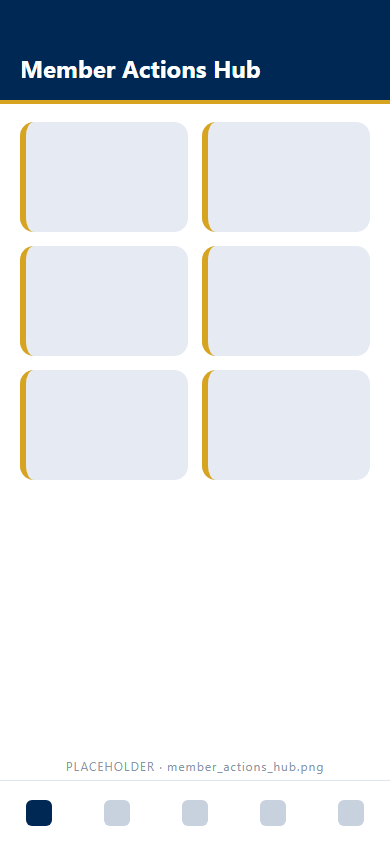
<!-- /KEEP_IMAGE -->

Some officer desks show a gold **Locked** badge. The badge tells you that the desk exists. Point at the badge to see who holds the desk.

The header at the top right of the portal has four controls.

- **Messaging** (envelope icon) opens **Council Messages & Alerts** and **My Distribution Lists**.
- **Help** (question-mark icon) opens the **Online Help Center**.
- The **bell** shows the alerts that council leadership sent in the last 6 months.
- **Your name and photo** opens the member menu. The member menu holds **My Profile** and **Sign out**.

<!-- KEEP_IMAGE: member dashboard setup placeholder -->
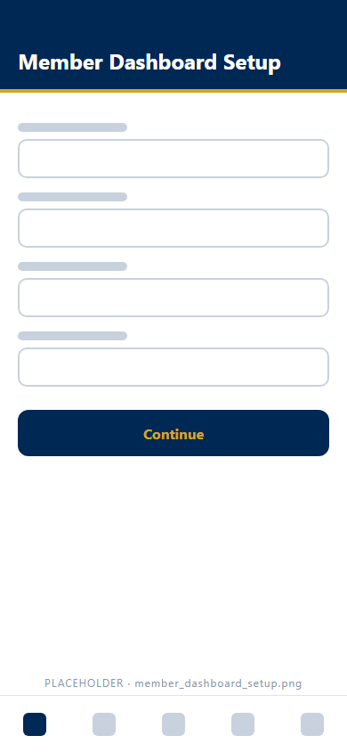
<!-- /KEEP_IMAGE -->

---

## 2. Get into your account

> **Before you start**
> - **Access:** a member whom a council Admin added to the roster. Nobody can register without the Admin.
> - **Data loss:** the setup code works one time only. A reset code expires after 15 minutes.

### Concept: the setup code

Your welcome email contains a one-time setup code. The code has 20 characters in four groups, like `XXXXX-XXXXX-XXXXX-XXXXX`.
The phone app asks for the setup code when you create your password. The code expires 14 days after the email is sent.
A used code does not work a second time.

### 2.1 Install the phone app

> **Who can do this:** any member on the council roster.

**Goal:** Open the KofC Tracker phone app on your phone.

**Start point:** Your welcome email, or the printed codes below.

**Steps:**
1. Open your welcome email.
2. Follow the Expo Go download steps in the email.
3. Point your phone camera at the **Mobile App (Expo Go)** code below.
4. Tap the link that the camera shows.

<!-- KEEP_IMAGE: onboarding QR codes for the app and member sign-up -->
| Mobile App (Expo Go) | Member Sign-Up |
|---|---|
|  |  |
| Open the KofC Tracker phone app in Expo Go. | Ask to join the council. |
<!-- /KEEP_IMAGE -->

**Expected result:** The phone app opens on the screen **Welcome. What is your email address?**

**Common problems:**
| Problem | Cause | Fix |
| --- | --- | --- |
| The camera does not react to the code. | The code is too far away or too small. | Hold the phone 15 to 30 cm from the code. |
| You did not get a welcome email. | The Admin has not added you, or the email went to spam. | Check your spam folder. Then call your council Admin. |

### 2.2 Create your password on the phone

> **Who can do this:** a member on the roster who has no password yet.
> **Warning:** the setup code works one time only. Keep the welcome email until you finish.

**Goal:** Create the password that opens the phone app and the web portal.

**Start point:** Phone app → **Welcome. What is your email address?**

**Steps:**
1. Enter your email address in **EMAIL**.
2. Tap **Continue**. The screen **Welcome, *your name*. Choose a password.** opens.
3. Enter the code from your welcome email in **SETUP CODE FROM YOUR WELCOME EMAIL**.
4. Enter a password of at least 8 characters in **PASSWORD**.
5. Enter the same password in **CONFIRM PASSWORD**.
6. Tap the eye icon to check what you typed.
7. Tap **Create password**. The app uses the setup code now. You cannot use the code again.

<!-- KEEP_IMAGE: onboarding email check placeholder -->
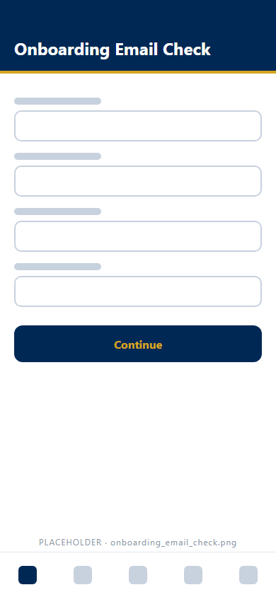
<!-- /KEEP_IMAGE -->

<!-- KEEP_IMAGE: create password screen placeholder -->
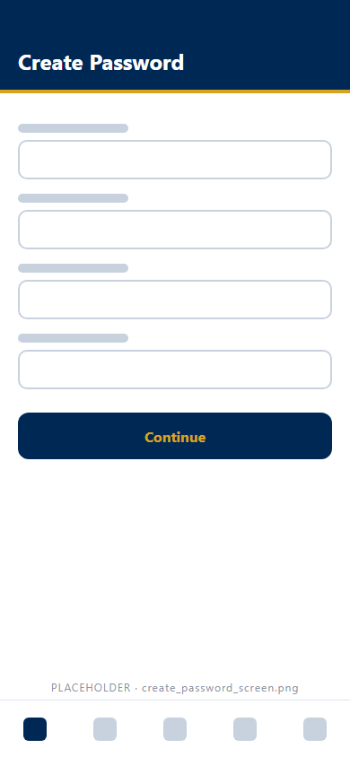
<!-- /KEEP_IMAGE -->

**Expected result:** The **Home** tab opens. The phone keeps you signed in until you sign out.
The phone also turns on biometric sign-in for your account (see 2.4).

**Common problems:**
| Problem | Cause | Fix |
| --- | --- | --- |
| *"We could not find … in the member roster."* and a **Contact your council admin** card | Your email is not on the roster, or the email has a typo. | Tap **Try a different email**. If the email is correct, call the Admin on the card. |
| *"That setup code is not valid for this email, has already been used, or has expired."* | The code is wrong, used or older than 14 days. | Ask your council Admin to send a new setup code. |
| *"The two passwords do not match."* | **CONFIRM PASSWORD** differs from **PASSWORD**. | Type both passwords again. |
| The app refuses the password. | The password has fewer than 8 characters. | Choose a longer password. |
| The screen shows **Welcome back**. | You created a password before. | Sign in with your password (2.3). |

### 2.3 Sign in on the phone with a password

> **Who can do this:** any member with a password.

**Goal:** Open the phone app after you signed out.

**Start point:** Phone app → **Welcome. What is your email address?**

**Steps:**
1. Enter your email address in **EMAIL**.
2. Tap **Continue**. The **Welcome back** screen opens.
3. Enter your password in **PASSWORD**.
4. Tap **Sign in**.

**Expected result:** The **Home** tab opens.

**Common problems:**
| Problem | Cause | Fix |
| --- | --- | --- |
| *"Incorrect password. Please try again."* | The password is wrong. | Type the password again. If you forgot the password, reset the password (2.6). |

### 2.4 Sign in on the phone with Face ID or a fingerprint

> **Who can do this:** a member who created the password on this phone with a setup code.

**Goal:** Sign in without typing your password.

**Start point:** Phone app → the email screen or the **Welcome back** screen.

**Steps:**
1. Tap **🔑 Sign In with FaceID / Biometrics**.
2. Look at the phone, or touch the fingerprint sensor.

**Expected result:** The **Home** tab opens.

**Common problems:**
| Problem | Cause | Fix |
| --- | --- | --- |
| The biometric button does not show. | You created your password on another phone, or before biometric sign-in existed. | Sign in with your password. |
| *"The biometric check did not pass."* | The phone did not recognize your face or finger. | Try again, or sign in with your password. |
| *"Face ID or fingerprint is not available on this phone right now."* | The phone has no enrolled face or finger. | Sign in with your password. |

### 2.5 Sign in to the web portal

> **Who can do this:** any member with a password.

**Goal:** Open the web portal in a web browser.

**Start point:** The portal address that your council gave you.

**Steps:**
1. Enter your email address in **Email**.
2. Enter your password in **Password**.
3. Select **Sign in**.

<!-- KEEP_IMAGE: portal sign-in placeholder -->
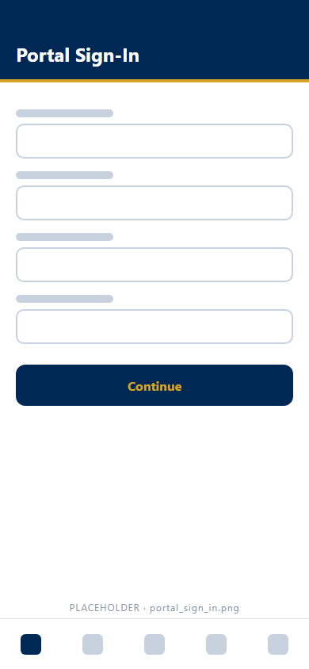
<!-- /KEEP_IMAGE -->

**Expected result:** The portal opens with the sidebar on the left.

**Common problems:**
| Problem | Cause | Fix |
| --- | --- | --- |
| *"That email and password do not match a registered member."* | The email or the password is wrong. | Check both fields. |
| You never created a password. | You create the password in the phone app only. | Do task 2.2 on your phone first. |

### 2.6 Reset a forgotten password

> **Who can do this:** any member with a password.
> **Warning:** the reset code expires after 15 minutes. The code stops working after 5 wrong tries.

**Goal:** Choose a new password without help from an Admin.

**Start point:** Phone app → **Forgot Password?** link. Web portal → **Forgot Password?** link on the sign-in panel.

**Steps:**
1. Select **Forgot Password?**.
2. Enter the email address that you sign in with.
3. Select **Email me a reset code**.
4. Open the email. Find the 6-digit code.
5. Enter the code in **6-DIGIT RESET CODE** (phone) or **6-digit reset code** (web).
6. Select **Continue**.
7. Enter a new password of at least 8 characters, two times.
8. Select **Save new password** (phone) or **Save new password and sign in** (web).

**Expected result:** You are signed in with the new password.

**Common problems:**
| Problem | Cause | Fix |
| --- | --- | --- |
| No email arrives. | The email address is not on the roster. The screen gives the same answer for every address. | Check the address. Then ask your council Admin. |
| A second request does nothing. | The platform ignores a new request within 60 seconds. | Wait 60 seconds. Then request again. |
| The code is refused. | The code expired, or a newer request replaced the code. | Request a new code. Use only the newest code. |

### 2.7 Sign out

> **Who can do this:** any signed-in member.

**Goal:** Close your session on a phone or a browser.

**Start point:** Phone app → your name in the header → **Settings**. Web portal → your name at the top right.

**Steps:**
1. Phone: open **Settings**. Tap **Sign out** under **Account**.
2. Web: select your name. Select **Sign out**.

**Expected result:** The sign-in screen opens. The phone keeps the biometric key, so biometric sign-in still works next time.

**Common problems:**
| Problem | Cause | Fix |
| --- | --- | --- |
| The header shows no **Sign out** button. | Large Text Layout Mode hides the header text. | Tap **⚙ Settings**. Then tap **Sign out**. |

---

## 3. Sign up for shifts

> **Before you start**
> - **Access:** any active member. The pages show only when your council keeps the **Event shifts** module on.
> - **Data loss:** none. The phone app has no button to leave a shift. Tell the event owner if you cannot work.

### Concept: shifts, tags and the sign-up window

An event has one or more shifts. A shift has a date, a time and a minimum number of volunteers.
The phone **Signup** tab lists shifts in the next 30 days. The web **Registration desk** lists shifts in the next 6 months.
Both lists show your council and its sister councils.

| Tag | Meaning |
| --- | --- |
| **NEEDS *n* MORE** | The shift still needs *n* volunteers. |
| **Priority** (gold) | Nobody has signed up yet, or the shift starts within 7 days. |
| **WITHIN 2 DAYS** (red) | The shift starts within 48 hours. |
| **FULL** | The shift has its minimum volunteers. |
| **YOU'RE SIGNED UP** | You are on the shift. |

A full shift still takes extra volunteers. An extra volunteer is an honorary volunteer.

### 3.1 Sign up for a shift on the phone

> **Who can do this:** any active member.

**Goal:** Put your name on a shift.

**Start point:** Phone app → **Signup** tab.

**Steps:**
1. Open the **Shifts Opening** sub-tab. Use the **Full Up** sub-tab for full shifts.
2. Optional: choose a council in the **Council** filter.
3. Find the shift.
4. Tap **Sign up**. On a full shift, tap **Sign up as honorary volunteer**.

<!-- KEEP_IMAGE: shift feed filters placeholder -->
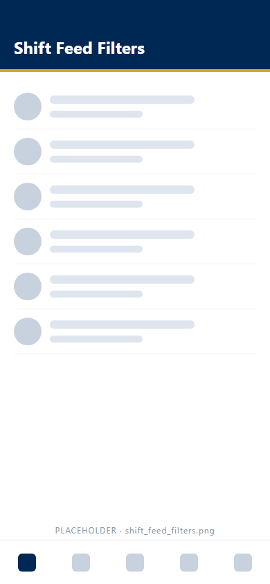
<!-- /KEEP_IMAGE -->

<!-- KEEP_IMAGE: phone shift feed capture -->
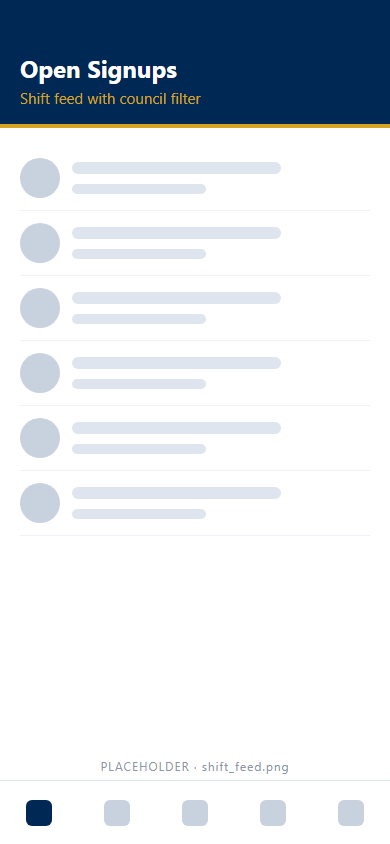
<!-- /KEEP_IMAGE -->

<!-- KEEP_IMAGE: phone shift signup capture -->
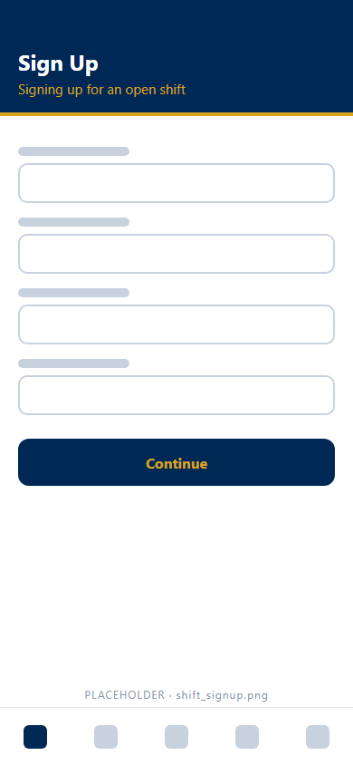
<!-- /KEEP_IMAGE -->

**Expected result:** The shift card shows **YOU'RE SIGNED UP**. The shift also shows under **My shifts** on the **Home** tab.

**Common problems:**
| Problem | Cause | Fix |
| --- | --- | --- |
| The **Signup** tab is missing. | Your council switched off the **Event shifts** module. | Ask your council Admin. |
| *"No shift in the next 30 days for this filter is full yet."* | No full shift matches the filter on **Full Up**. | Change the **Council** filter, or use **Shifts Opening**. |
| The shift is not in the list. | The shift is more than 30 days away. | Use the web **Registration desk** (3.2). |

### 3.2 Register for a shift in the web portal

> **Who can do this:** any active member.

**Goal:** Put your name on a shift that still needs volunteers.

**Start point:** Sidebar → Faith In Action → **Member Actions Hub** → **Registration desk** tab.

**Steps:**
1. Optional: choose a council in **Council**. The default is **All: my council and sister councils**.
2. Find the shift in the table.
3. Select **Register**.

<!-- KEEP_IMAGE: registration desk placeholder -->
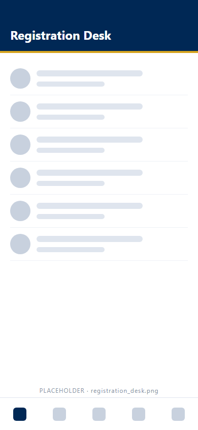
<!-- /KEEP_IMAGE -->

**Expected result:** The **Register** button changes to a **Registered** pill.

**Common problems:**
| Problem | Cause | Fix |
| --- | --- | --- |
| *"Every shift in range has its volunteers."* | The desk lists only shifts that need volunteers. | Use the phone **Full Up** sub-tab to join a full shift. |

### 3.3 Check your upcoming shifts

> **Who can do this:** any member.

**Goal:** See the shifts that you signed up for.

**Start point:** Phone app → **Home** → **My shifts**. Web portal → Faith In Action → **Member Actions Hub** → **My active shifts**.

**Steps:**
1. Open the start point.
2. Read the date, the time and the location of each shift.

<!-- KEEP_IMAGE: home dashboard placeholder -->
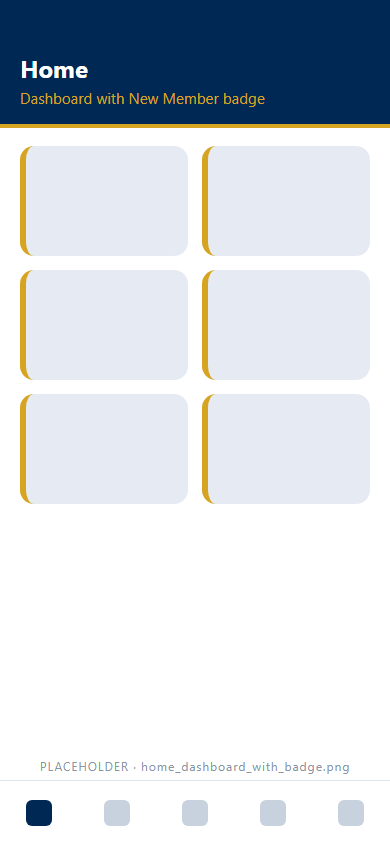
<!-- /KEEP_IMAGE -->

<!-- KEEP_IMAGE: legacy absence screen placeholder (the phone absence button was removed in Sprint 6A) -->
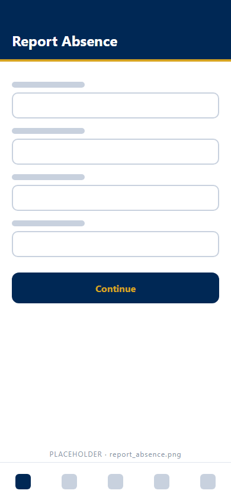
<!-- /KEEP_IMAGE -->

**Expected result:** A shift within 48 hours shows in red. The phone shows **WITHIN 2 DAYS**. The web shows **Within 48 hours**.
Other shifts show **Scheduled** on the web.

**Common problems:**
| Problem | Cause | Fix |
| --- | --- | --- |
| A shift left **My shifts**. | The phone hides a shift when the shift ends. The phone also hides a shift marked as a no-show. | Check **My shift history** in the web **Hour ledger**. |
| You cannot work a shift. | The phone app has no absence button. | Tell the event owner. The event owner finds a replacement. |

---

## 4. Log your hours with the Rapid-Tap grid

> **Before you start**
> - **Access:** any active member logs activity time. Only a member who signed up for a shift logs time on that shift.
> - **Data loss:** a confirmed tap saves 15 minutes at once. **Clear** throws away queued taps.
> - **Data loss:** queued taps live on this phone only. Close the app before you slide, and the queued taps are lost.
> - **Data loss:** a new save on a shift replaces the earlier hours for that shift.

### Concept: the 15-minute rule

The platform records time in 15-minute steps. One step is 0.25 hours.

| You log | The platform saves |
| --- | --- |
| 15 min | 0.25 |
| 1 h 15 min | 1.25 |
| 2 h 45 min | 2.75 |

- One entry is more than 0 hours and no more than 24 hours.
- You may log more time than the planned shift length.
- The platform refuses any other value, such as 1.33 hours.

### Concept: the Rapid-Tap grid

The **Report** tab opens on the **Activities** sub-tab. The sub-tab shows a grid of large navy tiles.
Each tile is one council activity, such as Parish Maintenance. One tap on a tile is 15 minutes of today's time.

Each tile shows a gold status line.

| Status line | Meaning |
| --- | --- |
| **+15 MIN** | You logged no time on the activity today. |
| ***n* H *n* M TODAY** | The time that the platform saved for you today. |
| **+*n* M QUEUED** | Taps that wait for the slide bar. The platform has not saved the taps yet. |

<!-- KEEP_IMAGE: rapid-tap grid placeholder -->
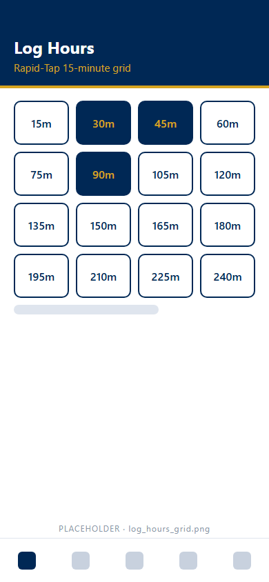
<!-- /KEEP_IMAGE -->

### Concept: the safety gates

A phone in a pocket can touch the screen by accident. A safety gate stops an accidental touch from logging time.
The phone picks one gate for you. You do not choose the gate.

| Gate | When the phone uses the gate | How a tap is saved |
| --- | --- | --- |
| **Biometric gate** | The phone has Face ID or a fingerprint enrolled. | You confirm the tap with your face or finger. The tap saves at once. |
| **Slide gate** | The phone has no Face ID or fingerprint enrolled. | The tap goes into a queue. You drag **Slide to Log Hours** to save the queue. |

The muted line under **Tap an activity: 15 minutes per tap** tells you which gate is on.

- Biometric gate: *"Each tap is confirmed with Face ID or your fingerprint, so a phone in a pocket cannot log time."*
- Slide gate: *"Taps wait in a queue. When you are done, drag the Slide to Log Hours bar at the bottom to save them."*

One good scan covers your taps for the next 60 seconds. A burst of taps needs one scan only.
The phone never asks for a passcode instead of a scan.

### Concept: time windows

| You log | Window |
| --- | --- |
| A council activity on the web | Dates up to 6 months before today |
| A council activity on the phone | Today only |
| A shift on the web | Shifts up to 3 months before today |
| A shift on the phone | From the event start to 30 days after the event ends, inside the 3-month window |

After a window closes, the platform locks the entry. The lock protects the council's records.

### Concept: reminders

You get a text reminder when you signed up for a shift and logged no hours.

- The first reminder goes out 5 days after the shift.
- A new reminder goes out every 7 days.
- Reminders stop when the shift is more than 3 months old.

### 4.1 Log activity time with the biometric gate

> **Who can do this:** any active member on a phone with Face ID or a fingerprint enrolled.
> **Warning:** each confirmed tap saves 15 minutes at once. The phone does not ask again.

**Goal:** Log today's time on a council activity, 15 minutes per tap.

**Start point:** Phone app → **Report** tab → **Activities** sub-tab.

**Steps:**
1. Find the activity tile under **Tap an activity: 15 minutes per tap**.
2. Count your time in 15-minute steps. For example, 1 hour is 4 taps.
3. Tap the tile one time. The prompt **Confirm it is you to log hours** opens.
4. Look at the phone, or touch the fingerprint sensor. The tap saves at once.
5. Tap the tile again for each more 15 minutes. Within 60 seconds, the phone does not scan again.
6. Read the tile status line. Check that the total is correct.

<!-- KEEP_IMAGE: log time picker placeholder -->
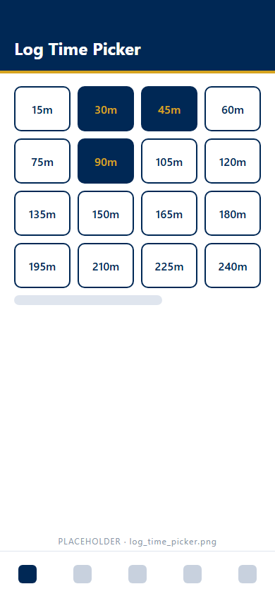
<!-- /KEEP_IMAGE -->

<!-- KEEP_IMAGE: phone log time activity capture -->

<!-- /KEEP_IMAGE -->

<!-- KEEP_IMAGE: pocket gate biometric scan placeholder -->
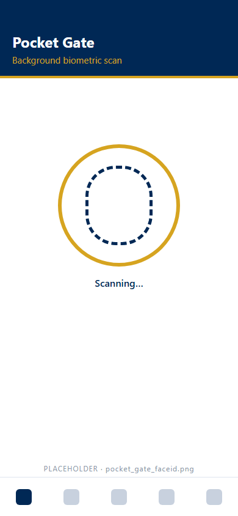
<!-- /KEEP_IMAGE -->

**Expected result:** A message shows the new total, for example *"+15 min · Parish Maintenance (1 h 15 m today)"*.
The tile status line shows today's total, for example **1 H 15 M TODAY**.

**Common problems:**
| Problem | Cause | Fix |
| --- | --- | --- |
| *"Not logged: Face ID or fingerprint was not confirmed."* | The scan failed, or you tapped **Cancel**. The platform saved nothing. | Tap the tile again. |
| You tapped too many times. | Each confirmed tap saved 15 minutes. | Ask your council Admin to correct the entry. |
| The tiles start to queue taps. | The phone lost its Face ID or fingerprint setup. The phone switched to the slide gate. | Save the queue with the slide bar (4.2). |
| *"Your council has no activities yet. An admin can add them."* | The council has no activity list. | Ask your council Admin to add activities. |
| You need to log a past date. | The phone logs today only. | Use the web **Hour ledger** (4.5). |

### 4.2 Log activity time with the slide gate

> **Who can do this:** any active member on a phone without Face ID or a fingerprint enrolled.
> **Warning:** queued taps are not saved until you slide. Do not close the app with taps in the queue.

**Goal:** Save a group of queued activity taps in one action.

**Start point:** Phone app → **Report** tab → **Activities** sub-tab.

**Steps:**
1. Find the activity tile under **Tap an activity: 15 minutes per tap**.
2. Tap the tile one time for each 15 minutes. Each tap goes into the queue.
3. Read the message *"Queued +15 min · activity name. Slide below to log."*
4. Check the queue total above the slide bar, for example **1 h queued**.
5. Put your thumb on the gold circle at the left of **Slide to Log Hours**.
6. Drag the circle to the right end of the bar. Then let go.

<!-- KEEP_IMAGE: slide to commit bar placeholder -->
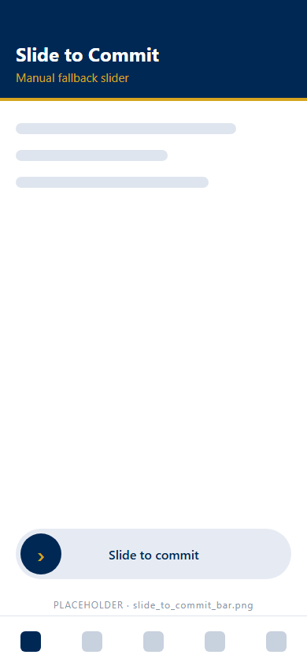
<!-- /KEEP_IMAGE -->

**Expected result:** A message shows *"Logged 1 h for today."* The slide bar closes.
The tile status line shows the new total for today.

**Common problems:**
| Problem | Cause | Fix |
| --- | --- | --- |
| The circle springs back. Nothing saves. | You let go before the right end of the bar. | Drag the circle all the way to the right end. |
| The queue stays after a slide. | The platform refused one save. The refused taps stay in the queue. | Read the error message. Then slide again. |
| The queue total is too high. | You tapped too many times. | Tap **Clear** (4.3). Then tap again. |

### 4.3 Clear queued taps

> **Who can do this:** any active member with taps in the queue.
> **Warning:** **Clear** throws away every queued tap. The platform saved nothing for the cleared taps.

**Goal:** Remove queued taps that are wrong, before the platform saves them.

**Start point:** Phone app → **Report** tab → **Activities** sub-tab → the slide bar at the bottom.

**Steps:**
1. Read the queue total above the slide bar.
2. Tap **Clear**. You cannot undo this.
3. Tap the tiles again for the correct time.

**Expected result:** The slide bar closes. The **QUEUED** text leaves each tile.
Time that you saved earlier today stays saved.

**Common problems:**
| Problem | Cause | Fix |
| --- | --- | --- |
| Saved time is still on the tile. | **Clear** removes queued taps only. | Ask your council Admin to correct saved time. |

### 4.4 Log shift hours on the phone

> **Who can do this:** any member who signed up for the shift.
> **Warning:** a new save replaces the earlier hours for the same shift.

**Goal:** Report the time that you worked on a shift.

**Start point:** Phone app → **Report** tab → **A shift I worked** sub-tab.

**Steps:**
1. Under **Which shift?**, tap the shift. The app picks your newest shift with **NO TIME LOGGED YET**.
2. Under **How long?**, check the total. The total starts at the planned shift length.
3. Tap **− 15 min** or **+ 15 min** to change the total.
4. Optional: add text in **NOTES (OPTIONAL)**.
5. Tap **Save time**. The new total replaces any earlier total for the shift.

<!-- KEEP_IMAGE: phone log time shift capture -->
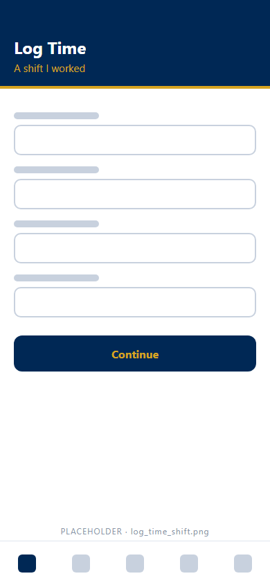
<!-- /KEEP_IMAGE -->

**Expected result:** A message shows *"Saved 3 h to Morning Setup"*. The shift card shows **LOGGED 3 H · TAP TO CHANGE**.

**Common problems:**
| Problem | Cause | Fix |
| --- | --- | --- |
| The button shows **🔒 Reporting locked**. | The event has not started, or the event ended more than 30 days ago. | Use the web **Hour ledger** within 3 months of the shift. |
| The **A shift I worked** sub-tab is missing. | Your council switched off the **Event shifts** module. | Log activity time only. |
| *"You have no shifts in the last 3 months to report time for."* | You have no shift in the window. | Log activity time instead. |

### 4.5 Log hours in the web portal

> **Who can do this:** any active member.
> **Warning:** a new save on the same shift replaces the earlier hours.

**Goal:** Log shift or activity time from a computer.

**Start point:** Sidebar → Faith In Action → **Member Actions Hub** → **Hour ledger** tab.

**Steps:**
1. For a shift: go to **Report time on a shift**. Choose the shift in **Shift I worked**.
2. For an activity: go to **Report time on an activity**. Choose **Council activity** and **Date worked**.
3. Choose **Hours** and **Minutes**. Minutes are :00, :15, :30 or :45.
4. Optional: add text in **Notes (optional)**.
5. Select **Save shift hours** or **Save activity hours**.

**Expected result:** The time shows in **My shift history** or **My activity history**.

**Common problems:**
| Problem | Cause | Fix |
| --- | --- | --- |
| The shift is not in **Shift I worked**. | The shift is more than 3 months old. | Ask your council Admin to check the record. |
| The date is refused. | The date is more than 6 months ago. | The window is closed. Ask your council Admin. |

### 4.6 Review your hour history

> **Who can do this:** any member, on the member's own history.

**Goal:** Check which shifts still need hours.

**Start point:** Sidebar → Faith In Action → **Member Actions Hub** → **Hour ledger** → **My shift history**.

**Steps:**
1. Read the status of each past shift.
2. Log hours for each shift with **Hours needed** (4.5).

<!-- KEEP_IMAGE: hour ledger history placeholder -->
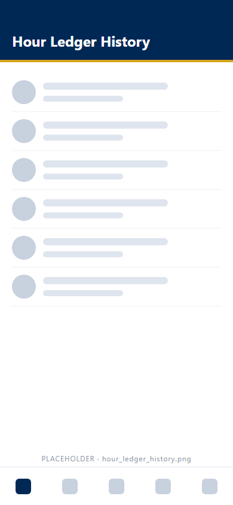
<!-- /KEEP_IMAGE -->

**Expected result:** Every past shift shows one of four statuses.

| Status | Meaning |
| --- | --- |
| **Logged** | The hours are saved. |
| **Hours needed** | You worked the shift. You did not log hours yet. |
| **No-show** | An Admin marked you absent. |
| **Closed** | The 3-month window has passed. |

**Common problems:**
| Problem | Cause | Fix |
| --- | --- | --- |
| A shift shows **No-show** by mistake. | An Admin marked the no-show. | Ask your council Admin to clear the no-show. |

---

## 5. Read agendas and follow live meetings

> **Before you start**
> - **Access:** any active member reads agendas. Only officers, Admins and the meeting owner change a meeting.
> - **Access:** the **Mtgs** tab shows only when your council keeps the **Meeting management** module on.
> - **Data loss:** none. The agenda is read only. An invitation answer saves at once, and you can change the answer.

### Concept: invitations

Officers schedule council meetings and invite members. Some invitations are released 5 days before the meeting.
An invitation does not show in your list before the release day.

### Concept: the full-text agenda

Each meeting has an agenda, called the order of business. The agenda has numbered sections, such as **I.**, **II.** and **III.**
Each section has numbered lines. The phone shows the full text of every line.

Each line can show three more items.

- The speaker's name and role, for example *Tom · Grand Knight*.
- A motion result tag: **PENDING**, **PASSED**, **FAILED** or **TABLED**.
- A hand count, for example **Hands 24 – 3**.

### Concept: live tracking and the gold highlight

During a live meeting, the Grand Knight (GK) puts one agenda line "on the floor". The line on the floor is the item under discussion now.
The phone reads the agenda again every 3 seconds. The phone marks the line on the floor in four ways.

| Mark | Where | What the mark shows |
| --- | --- | --- |
| **● LIVE** tag (red) | The navy agenda header | The meeting is in progress. |
| **NOW ON THE FLOOR** banner (gold) | Under the header | The item name and the time left on the item. |
| Navy section heading | The section title | The section that holds the line on the floor. |
| Gold line with a heavy navy frame and an **ON THE FLOOR** tag | The agenda line | The exact line under discussion. |

> **Large Text Layout Mode:** the phone does not fill any mark with gold. Each mark is black inside a thick white frame.

### 5.1 Answer a meeting invitation

> **Who can do this:** any member with an invitation.

**Goal:** Tell the council that you will attend.

**Start point:** Phone app → **Mtgs** tab → **My Invites**.

**Steps:**
1. Find the meeting card.
2. Tap **👍 Count Me In**.
3. To withdraw your answer, tap **✓ Attending**.

**Expected result:** The button changes to a green **✓ Attending** banner. The app saves the answer at once.

**Common problems:**
| Problem | Cause | Fix |
| --- | --- | --- |
| *"You have no meeting invitations."* | You have no invitation, or the release day has not come. | Check **All Schedules**. |
| The button changes back. | The save failed. A message gives the reason. | Read the message. Then tap again. |

### 5.2 Read the full-text agenda before a meeting

> **Who can do this:** any active member of the council.

**Goal:** Read every agenda line before the meeting starts.

**Start point:** Phone app → **Mtgs** tab.

**Steps:**
1. Find the meeting card under **My Invites** or **All Schedules**.
2. Tap **📋 Full agenda**. The **Agenda** sub-tab opens on the meeting.
3. Or: tap the **Agenda** sub-tab. Tap the meeting date and name in the row of buttons at the top.
4. Read the navy header. The header shows the meeting name, the date, the time and the location.
5. Scroll down through the sections and the lines.
6. Read the speaker and the motion tag under each line.

**Expected result:** The agenda shows every section in order. Each line shows its full text.
The **Agenda** sub-tab opens on the live meeting by default. With no live meeting, the sub-tab opens on the next meeting.

**Common problems:**
| Problem | Cause | Fix |
| --- | --- | --- |
| *"Nothing listed."* under a section | The section has no lines yet. | Check again closer to the meeting. |
| *"Your council has no upcoming meeting with an agenda."* | The council has no meeting on the calendar. | Check again later. |
| A line in the web agenda is not on the phone. | An officer is still writing the line. The phone hides a blank line. | Wait. The phone shows the line when the officer adds text. |

### 5.3 Follow a live agenda on the phone

> **Who can do this:** any active member of the council.

**Goal:** See which agenda line is on the floor now.

**Start point:** Phone app → **Mtgs** tab.

**Steps:**
1. Find the meeting card with the live mark.
2. Tap **● Follow the live agenda**. The **Agenda** sub-tab opens.
3. Check for the red **● LIVE** tag in the navy header.
4. Read the gold **NOW ON THE FLOOR** banner. The banner shows the item name and the time left.
5. Scroll to the navy section heading.
6. Find the gold line with the **ON THE FLOOR** tag.
7. Keep the screen open. The gold highlight moves when the Grand Knight moves to the next line.

<!-- KEEP_IMAGE: live agenda gold highlight placeholder -->
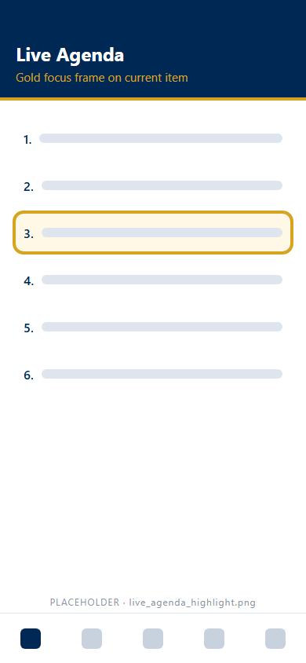
<!-- /KEEP_IMAGE -->

**Expected result:** The gold highlight stays on the line under discussion. The countdown in the banner goes down each second.

**Common problems:**
| Problem | Cause | Fix |
| --- | --- | --- |
| *"The meeting is live. The line on the floor will be framed as the Grand Knight takes each item."* | The Grand Knight has not put a line on the floor yet. | Wait. The highlight shows when the first item starts. |
| The highlight does not move. | The phone lost its connection. | Check your data or Wi-Fi connection. |
| No gold shows in Large Text Layout Mode. | Large text mode uses black inside a white frame. | Look for the thick white frame. |

### 5.4 Read meetings in the web portal

> **Who can do this:** any member.

**Goal:** Read a meeting's details, agenda and minutes.

**Start point:** Sidebar → Governance → **Meeting Center**.

**Steps:**
1. Select the meeting in the list.
2. Read the agenda and the minutes link.

**Expected result:** The meeting details open on the right side.

**Common problems:**
| Problem | Cause | Fix |
| --- | --- | --- |
| No **Edit** controls show. | Only officers, Admins and the meeting owner change a meeting. | Ask an officer. |

---

## 6. File expenses and check status tags

> **Before you start**
> - **Access:** any active member files a report. Each member sees only the member's own reports.
> - **Data loss:** after **Submit for approval**, you cannot change the report. Only a return from leadership reopens the report.
> - **Data loss:** a return clears both officer signatures. The report starts the approval path again.

### Concept: the expense path

You buy something for the council. You file an expense report with the receipts.
Two officers sign the report. Then the council pays you by check.

| Status tag | Meaning |
| --- | --- |
| **Draft** | You saved the report. You did not submit the report. |
| **Submitted** | The report waits for the Financial Secretary. |
| **Order Issued** | The Financial Secretary signed a written order. The report waits for the Grand Knight. |
| **Approved** | The Grand Knight signed. The report waits for payment. |
| **Reimbursed** | The Financial Secretary or the Treasurer recorded your check. |
| **Returned** (red) | Leadership sent the report back. The reason shows on the report. |

The platform sends no email or text about expense reports. Check the status tag.

### Concept: the 30-day submission window

A report for an event or a meeting has a submission window. The window opens on the first day of the event or meeting.
The window closes 30 days after the last day. You may save a draft at any time.
A **General** report has no window.

### 6.1 File an expense report on the phone

> **Who can do this:** any active member.
> **Warning:** after **Submit for approval**, you cannot change the report.

**Goal:** Ask the council to pay you back.

**Start point:** Phone app → **Home** → **Expense reports** → **My expense reports**.

**Steps:**
1. Tap **New expense report**.
2. Under **SPENT FOR**, tap **Event**, **Meeting** or **General**.
3. For an event or a meeting, choose the item in **WHICH EVENT?** or **WHICH MEETING?**. The list shows only open windows.
4. Tap **Scan Paper Receipt**. Photograph the receipt.
5. Enter **VENDOR NAME**, **EXPENSE DATE (YYYY-MM-DD)**, **AMOUNT** and **DESCRIPTION**.
6. Tap **+ Add another receipt** for each extra receipt.
7. Check the **REPORT TOTAL**.
8. Tap **Submit for approval**. You cannot change the report after this. Tap **Save draft** to finish later.

**Expected result:** The report shows in **My reports** with the **SUBMITTED** tag.

**Common problems:**
| Problem | Cause | Fix |
| --- | --- | --- |
| *"Locked. Submission opens …"* | The event or meeting has not started. | Save a draft. Submit on or after the first day. |
| *"Locked. Submission closed …"* | More than 30 days have passed since the end. | Contact the Financial Secretary. |
| The event is not in the list. | The window is closed or not open yet. | Use **General** only if the cost has no event or meeting. |

### 6.2 File an expense report in the web portal

> **Who can do this:** any active member.
> **Warning:** after **Submit for approval**, you cannot change the report.

**Goal:** File an expense report from a computer.

**Start point:** Sidebar → Finances → **My Expense Reports**.

**Steps:**
1. Select **New expense report**.
2. Choose the event, the meeting or **General council expense (no event or meeting)** in **Spent for**.
3. Fill in one line for each receipt. Select **+ Add line item** for more lines.
4. Attach the receipt file to each line.
5. Select **Submit for approval**. You cannot change the report after this. Select **Save draft** to finish later.

**Expected result:** A message shows *"Submitted report #n for $x to your council's leadership."*

**Common problems:**
| Problem | Cause | Fix |
| --- | --- | --- |
| The submit is refused. | The submission window is closed or not open. | Save a draft. Check the dates of the event or meeting. |

### 6.3 Check the status of an expense report

> **Who can do this:** the member who filed the report.

**Goal:** Learn where your report is in the approval path.

**Start point:** Phone app → **Home** → **My expense reports** → **My reports**. Web portal → Finances → **My Expense Reports**.

**Steps:**
1. Find the report by its number and total.
2. Read the status tag. Compare the tag with the table in the concept above.
3. For a **Reimbursed** report, read the check number and the date.

**Expected result:** The tag shows the current step. A paid report shows *"Paid by check n on date."*

**Common problems:**
| Problem | Cause | Fix |
| --- | --- | --- |
| The **Home** tab shows *"n of your expense reports was returned for changes."* | Leadership returned a report. | Fix the report (6.4). |

### 6.4 Fix and resubmit a returned report

> **Who can do this:** the member who filed the report.
> **Warning:** a return clears both officer signatures. The report starts the approval path again.

**Goal:** Correct a returned report.

**Start point:** Phone app → **My expense reports** → the report with **RETURNED**. Web portal → Finances → **My Expense Reports**.

**Steps:**
1. Read the reason under **RETURNED FOR CHANGES** (phone) or **Reason from council leadership** (web).
2. Tap **Fix and resubmit** (phone), or open the report (web).
3. Correct the receipts or the amounts.
4. Select **Submit for approval**.

**Expected result:** The tag changes to **SUBMITTED**.

**Common problems:**
| Problem | Cause | Fix |
| --- | --- | --- |
| The submit is refused. | The 30-day window closed. | Contact the Financial Secretary. |

---

## 7. Take donations at an event

> **Before you start**
> - **Access:** any active member. The **Donate** tab shows only when your council keeps the **Fundraising inflow** module on.
> - **Data loss:** **Record donation** and each gate-intake tap add a gift to the council's records at once.
> - **Data loss:** you cannot delete a donation on the phone. Only the Treasurer, the Financial Secretary or an Admin corrects a donation.

### Concept: event sessions and methods

The **Donate** tab links donations to an event. You start a session for the event. Every donation then goes to that event.
A donation without a session is a standalone donation.

| Tile hint | Methods | What happens |
| --- | --- | --- |
| **Record the amount** | Cash, and other methods your council adds | You enter the amount. |
| **Record the charge** | Credit Card | You enter the charged amount. |
| **Show the QR code** | Venmo, Zelle, Zeffy, ParishSoft | A full-screen code opens for the donor. |
| **Describe and value** | Physical items | You describe the items and estimate the value. |

### 7.1 Start a donation session for an event

> **Who can do this:** any active member of a council linked to the event.

**Goal:** Link the next donations to one event.

**Start point:** Phone app → **Donate** tab.

**Steps:**
1. Tap **Start accepting for an event**.
2. Choose the event in **EVENT**.
3. Optional: fill in **DEFAULT AMOUNT (OPTIONAL)**, **DEFAULT DONATION TYPE** and **DEFAULT DESCRIPTION (OPTIONAL)**.
4. Tap **Start**.

**Expected result:** A gold **ACCEPTING DONATIONS** card shows the event, the count and the total.

**Common problems:**
| Problem | Cause | Fix |
| --- | --- | --- |
| The event is not in the list. | The list shows an event from 2 hours before the first shift until midnight after the event ends. | Wait for the event start. Record a later gift as standalone. |

### 7.2 Record a donation

> **Who can do this:** any active member.
> **Warning:** **Record donation** adds the gift to the council's records at once.

**Goal:** Record one donor's gift.

**Start point:** Phone app → **Donate** → **How is the donor giving?**

**Steps:**
1. Tap the tile for the donor's method.
2. For a QR method: turn the phone to the donor. Wait for the donor's payment confirmation.
3. For a QR method: check the amount. Tap **Continue**.
4. Enter or check the amount.
5. Choose the **DONATION TYPE**.
6. Optional: fill in **DONOR NAME (OPTIONAL)** and **DESCRIPTION (OPTIONAL)**.
7. Tap **Record donation**. The gift saves at once.

<!-- KEEP_IMAGE: phone collection QR codes -->
| ParishSoft | Venmo | Zeffy | Zelle |
|---|---|---|---|
| 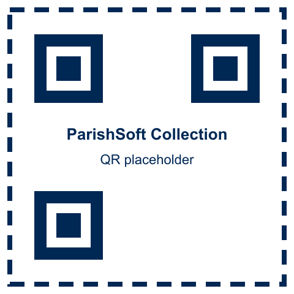 |  | 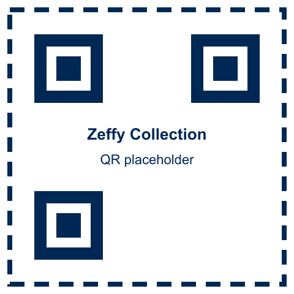 |  |
<!-- /KEEP_IMAGE -->

<!-- KEEP_IMAGE: donate method tiles placeholder -->
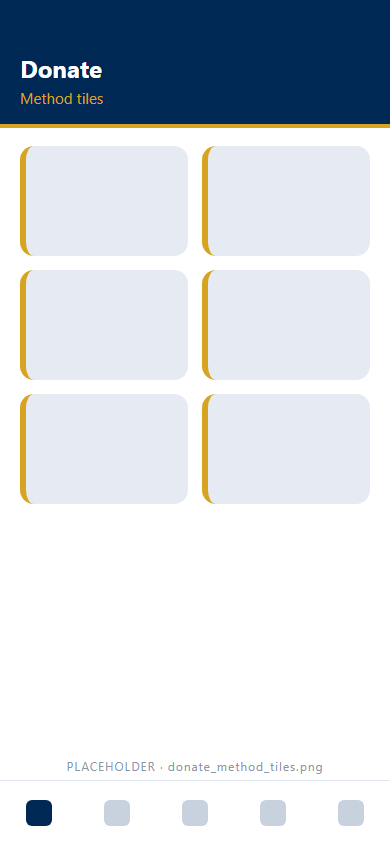
<!-- /KEEP_IMAGE -->

<!-- KEEP_IMAGE: QR code presentation placeholder -->
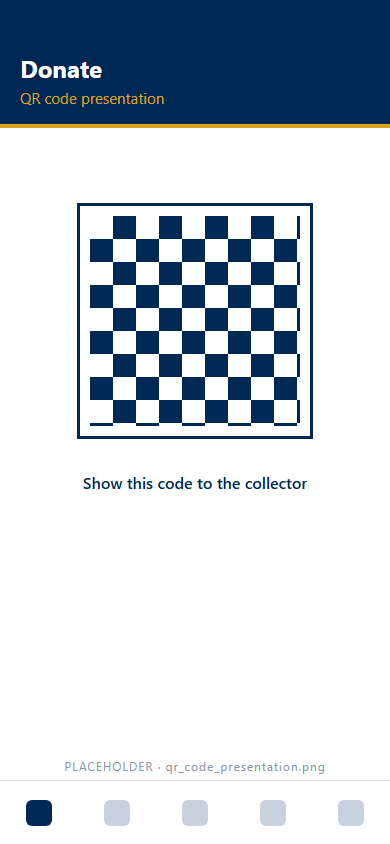
<!-- /KEEP_IMAGE -->

**Expected result:** A message confirms the amount, the method and the event.
**Recorded for this event** lists the donations from every phone.

**Common problems:**
| Problem | Cause | Fix |
| --- | --- | --- |
| *"Your council has not uploaded this QR code yet."* | A custom QR method has no image. | Take the gift as cash or card. Tell your council Admin. |
| *"The QR code could not be loaded."* | The phone is offline, or the image link is broken. | Take the gift as cash or card. |
| *"Your council has not enabled any donation methods yet."* | The council has no methods. | Ask an Admin, the Treasurer or the Financial Secretary. |

### 7.3 Record a physical item donation

> **Who can do this:** any active member.
> **Warning:** **Record donation** adds the items to the council's records at once.

**Goal:** Record donated goods.

**Start point:** Phone app → **Donate** → **Physical items** tile.

**Steps:**
1. Describe the items in **WHAT WAS DONATED**. The field is required.
2. Enter the estimated value.
3. Optional: tap **Take Verification Photo**.
4. Tap **Record donation**.

**Expected result:** The item donation is saved. Item values do not count toward the event's cash or electronic funds.

**Common problems:**
| Problem | Cause | Fix |
| --- | --- | --- |
| The save is refused. | **WHAT WAS DONATED** is empty. | Describe the items. |

### 7.4 Use one-tap gate intake

> **Who can do this:** any active member of a council linked to the event.
> **Warning:** each tap records a donation at once. You type nothing, and the phone does not ask again.

**Goal:** Record cash and card gifts quickly at an event gate.

**Start point:** Phone app → **Donate** → the **ACCEPTING DONATIONS** card.

**Steps:**
1. Turn on **🎬 Start Active Intake Session**. The intake opens for every phone on the event.
2. Choose a preset amount.
3. Tap **💵 Log Cash Transaction** for cash. The gift saves at once.
4. Tap **💳 Log Stripe CC Swipe** for a card. The app records the card gift only. The app charges no card.
5. Tap **Hide overlay** to see the normal screen.
6. Tap **Close intake** to end the intake.

**Expected result:** Each tap adds one donation to the event.

**Common problems:**
| Problem | Cause | Fix |
| --- | --- | --- |
| *"Cash is not enabled"* | The council has no Cash method. | Ask your council Admin to enable Cash. |
| You tapped one time too many. | Each tap saves a donation. | Ask the Treasurer, the Financial Secretary or an Admin to correct the donation. |

### 7.5 Stop the donation session

> **Who can do this:** the member who started the session on this phone.

**Goal:** End the event link on this phone.

**Start point:** Phone app → **Donate** → the **ACCEPTING DONATIONS** card.

**Steps:**
1. Tap **Stop accepting – the event is over**.

**Expected result:** New donations are standalone again.

**Common problems:**
| Problem | Cause | Fix |
| --- | --- | --- |
| A donation went to the wrong event. | The session was still on. | Ask the Treasurer, the Financial Secretary or an Admin to correct the donation. |

---

## 8. Propose a charity grant

> **Before you start**
> - **Access:** any active member. The page shows only when your council keeps the **Charity proposals** module on.
> - **Access:** you cannot vet your own request. Another officer or a Trustee vets the request.
> - **Data loss:** none. A filed request stays in **My requests**.

### Concept: the Knight Shepherd

Any member can bring an organization's request to the council. The member who files the request is the Knight Shepherd.
The request moves through three steps: **Vetting**, **Presentation** at a council meeting, and **Disbursement** of the check.
The Trustees ask the Shepherd for a status report 6 months after the filing date.

### 8.1 File a charity grant request

> **Who can do this:** any active member.
> **Warning:** you cannot vet your own request. Another officer or a Trustee vets the request.

**Goal:** Ask the council to fund an organization.

**Start point:** Sidebar → Finances → **Propose Charity Grant**.

**Steps:**
1. Fill in **Organization / Ministry**: the name, the mission and the mailing address.
2. Fill in **Contact Details**.
3. Fill in **The Request**: the amount, the date and the specific use.
4. Select **Save and submit for vetting**.

**Expected result:** A tracking message names the three steps and the follow-up date. The request shows in **My requests**.

**Common problems:**
| Problem | Cause | Fix |
| --- | --- | --- |
| The request stops at one step. | Vetting declined the request, or the council voted no. | Read the step in **My requests**. |

---

## 9. Messages, roster, profile and display

> **Before you start**
> - **Access:** any member. You change only your own profile, your own lists and your own display setting.
> - **Data loss:** a reply goes to everyone in the thread. You cannot take back a sent reply.
> - **Data loss:** a new email address also changes your sign-in name.

### 9.1 Read and reply to messages

> **Who can do this:** any member.
> **Warning:** a reply goes to everyone in the thread.

**Goal:** Read council messages and answer them.

**Start point:** Phone app → envelope in the header → **Messages**. Web portal → **Messaging** → **Council Messages & Alerts**.

**Steps:**
1. Select a message to open the thread.
2. Read the replies in order.
3. Write your reply.
4. Send the reply. Everyone in the thread gets the reply.

<!-- KEEP_IMAGE: phone messages inbox capture -->
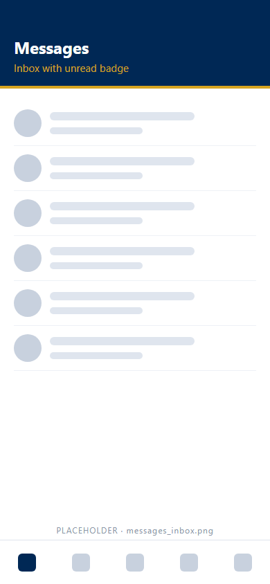
<!-- /KEEP_IMAGE -->

<!-- KEEP_IMAGE: phone message thread capture -->
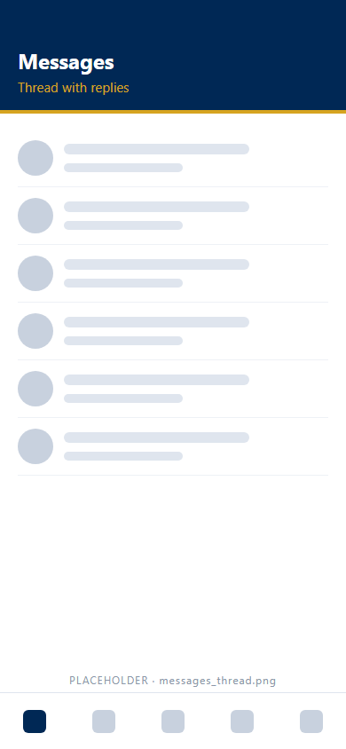
<!-- /KEEP_IMAGE -->

**Expected result:** The reply shows in the thread. On the phone, a **Replying to** line names the earlier message.

**Common problems:**
| Problem | Cause | Fix |
| --- | --- | --- |
| An attachment does not open on the phone. | The phone app has no attachment preview. | Open the message in the web portal. |

### 9.2 Build a private distribution list

> **Who can do this:** any member. Only you see your private lists.

**Goal:** Save a group of members for repeat messages.

**Start point:** Web portal → **Messaging** → **My Distribution Lists**.

**Steps:**
1. Enter a name in **List name**.
2. Pick members in **Members**. The picker searches by name.
3. Save the list.

**Expected result:** The list shows under your lists. Council-wide lists from Admins show there too, read only.

**Common problems:**
| Problem | Cause | Fix |
| --- | --- | --- |
| You cannot change a council-wide list. | Only Admins change council-wide lists. | Ask your council Admin. |

### 9.3 Find a Brother Knight's phone or email

> **Who can do this:** any member.

**Goal:** Contact another member.

**Start point:** Sidebar → Faith In Action → **Member Actions Hub** → **Fraternal roster** tab.

**Steps:**
1. Enter a name or a member number in **Search by name or number**.
2. Read the phone and the email in the row.

**Expected result:** The roster shows active members of your council and its sister councils.

**Common problems:**
| Problem | Cause | Fix |
| --- | --- | --- |
| A member is missing. | The member is not active. | Ask your council Admin. |

### 9.4 Update your profile

> **Who can do this:** any member, on the member's own profile.
> **Warning:** a new email address also changes your sign-in name.

**Goal:** Keep your photo, contact details and skills current.

**Start point:** Web portal → your name at the top right → **My Profile**.

**Steps:**
1. Select **Choose photo…** to add a photo. Use a square photo of at least 320 × 320 pixels.
2. Write up to 2,000 characters in **My fraternal biography**. Select **Save biography**.
3. Change your phone, email or address in **Contact details**. A new email is your new sign-in name.
4. Select **Save contact details**.
5. Add your trade skills in **Working status, skills and training**.

<!-- KEEP_IMAGE: web profile capture -->

<!-- /KEEP_IMAGE -->

<!-- KEEP_IMAGE: profile skills placeholder -->
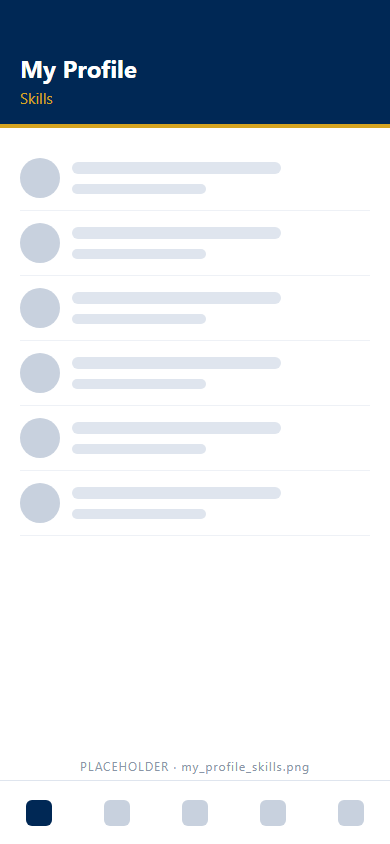
<!-- /KEEP_IMAGE -->

**Expected result:** The header shows your new photo. Admins can find you by skill.

**Common problems:**
| Problem | Cause | Fix |
| --- | --- | --- |
| You cannot change your name, member number or degree. | Council Admins keep these fields. | Ask your council Admin. |

### 9.5 Turn on Large Text Layout Mode

> **Who can do this:** any member, on the member's own account.

**Goal:** Make the phone app easier to read.

**Start point:** Phone app → your name in the header → **Settings** → **Display**. Web portal → **My Profile** → **Display settings**.

**Steps:**
1. Turn on **[ 👓 Enable Large Text Layout Mode ]**.

**Expected result:** The phone app shows larger bold white text on black, with gold borders and taller buttons.
The activity tiles fill the screen width, one tile per row. The web portal stores the setting only. The web portal does not change size.

**Common problems:**
| Problem | Cause | Fix |
| --- | --- | --- |
| The header shows no title or **Sign out**. | Large text mode hides the header text. | Tap **⚙ Settings** to sign out or to turn the mode off. |

### 9.6 Send feedback or report a bug

> **Who can do this:** any member.

**Goal:** Tell the platform administrators about a problem or an idea.

**Start point:** Sidebar → Answers → **Online Help Center** → **Submit System Feedback or Bug Report**.

**Steps:**
1. Check your name, council, phone and email. Change these details in **My Profile**.
2. Describe the problem in **What happened, or what would help?** Use up to 2,000 characters.
3. Select **Send feedback**.

**Expected result:** A message shows *"Thank you. Your feedback was sent to the platform administrators."*

**Common problems:**
| Problem | Cause | Fix |
| --- | --- | --- |
| The contact fields are locked. | The form copies your profile. | Change the details in **My Profile**. |

---

## 10. Troubleshooting reference

| Message or symptom | Cause | Fix |
| --- | --- | --- |
| *"We could not find … in the member roster."* | Your email is not on the roster. | Tap **Try a different email**, or call the Admin on the card. |
| *"That setup code is not valid for this email …"* | The setup code is wrong, used or expired. | Ask your council Admin for a new setup code. |
| *"The two passwords do not match."* | The two entries differ. | Type both passwords again. |
| *"Incorrect password. Please try again."* | The password is wrong. | Reset the password (2.6). |
| No biometric button | You set the password on another phone. | Sign in with your password. |
| A tab is missing on the phone | Your council switched off the module. | Ask your council Admin. |
| *"Not logged: Face ID or fingerprint was not confirmed."* | The scan failed or was cancelled. | Tap the activity tile again (4.1). |
| Taps say **QUEUED** | The phone uses the slide gate. | Drag **Slide to Log Hours** to the right end (4.2). |
| The slide circle springs back | You let go too early. | Drag the circle all the way to the right end. |
| **🔒 Reporting locked** on a shift | The 30-day phone window is closed. | Use the web **Hour ledger** within 3 months. |
| Hours refused as an invalid step | The value is not a 15-minute step. | Use :00, :15, :30 or :45. |
| Activity date refused | The date is more than 6 months ago. | The window is closed. Ask your council Admin. |
| The gold agenda highlight does not move | The phone lost its connection. | Check your data or Wi-Fi connection. |
| *"Locked. Submission closed …"* on an expense | The 30-day expense window is closed. | Contact the Financial Secretary. |
| QR code missing | The council has no image for the method. | Take cash or card. Tell your council Admin. |
| Event missing from **Donate** | The event is not at the gate yet. | Wait until 2 hours before the first shift. |

Still stuck? Open **Answers → Online Help Center**. You can also message your council Admin.

---

## 11. Automated messages reference

> **Delivery in this version:** the platform prepares emails and texts. The email and text services are not connected yet.
> Check the screen in the **Where to check** column. Alerts from officers always show under the bell in the web portal.

> **Hybrid messaging rule:** an email or a text is only a short nudge. The nudge sends you back to the platform.
> Conversations stay in **Messages**. Decisions on expenses and grants stay on the status tags and desks.
> No dollar amount or private reason goes by email or text.

### Charity grant requests

| When | What you get | Where to check |
| --- | --- | --- |
| You save a request | A tracking message with the three steps and the follow-up date | **Propose Charity Grant** → **My requests** |
| 6 months after filing | The Trustees ask you for a status report. The app sends no reminder. | The date in your tracking message |

### Expense reports

The platform sends no message about expense reports. Read the status tag (section 6).

### Volunteer service

| When | What you get | Where to check |
| --- | --- | --- |
| 24 hours before your shift | A reminder email with a calendar file | **Home** → **My shifts** |
| 24 hours before your meeting | A reminder email with a calendar file and the agenda | **Mtgs** → **My Invites** |
| 5 days after a shift with no hours | A text reminder | **Report** tab, or the web **Hour ledger** |
| Every 7 days after that | A follow-up text, until the shift is 3 months old | Same as above |
| An officer sends an urgent alert | A phone push alert and a bell entry | The bell in the web portal keeps 6 months of alerts |
| An Admin adds you to the roster | A welcome email with the app steps and a setup code | Ask your council Admin if the email is missing |
| You request a password reset | An email with a 6-digit code that expires in 15 minutes | The reset screen (2.6) |
